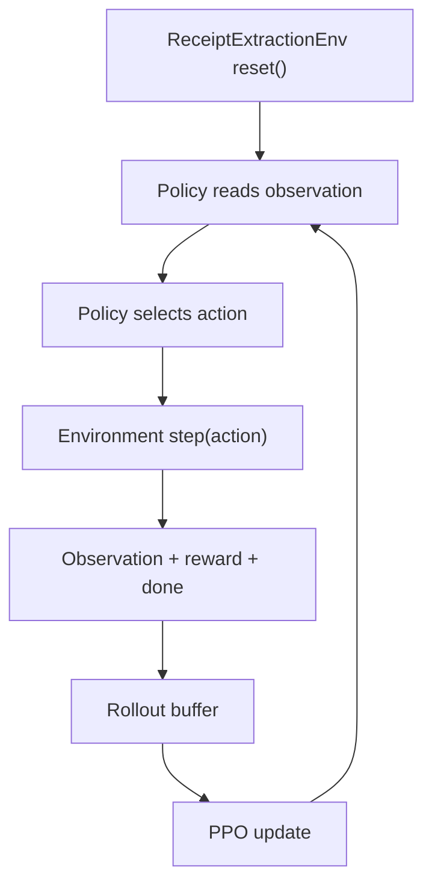

# How RL Is Applied

## Short Answer

RL is applied to the policy that interacts with the receipt-extraction environment, not to the base LLM.

The intended learning agent is:

- a policy that reads environment observations
- chooses the next action
- gets reward feedback
- improves through PPO updates over time

## RL Formulation

The project treats receipt extraction as a sequential decision problem instead of a single one-shot prediction.

### State / Observation

The policy can observe structured environment output such as:

- task and difficulty
- visible OCR regions
- scalar candidate lists for header and summary fields
- line-item candidates for hard receipts
- current draft
- validation feedback
- reconciliation feedback and delta
- remaining step budget
- step index

### Action

The policy chooses from typed actions, including:

- reveal the receipt or a window of OCR text
- inspect a region or nearby regions
- query candidates for one field
- query line-item candidates
- set or clear a field
- add or remove a line item
- normalize or validate a field
- check receipt-level consistency
- submit the final draft

### Reward

The reward function provides:

- positive signal when the draft improves
- penalties for wasteful or invalid actions
- a terminal reward based on the final deterministic grade

### Objective

The policy should maximize task completion quality under the environment’s step budget and uncertainty.

## What Actually Learns

The trainable component is the policy module.

Conceptually:

```text
observation -> policy network -> action
                    ^
                    |
             updated by PPO from reward
```

That policy is meant to learn:

- what action to take next
- which field to focus on
- whether to inspect more OCR evidence
- which candidate to select
- when validation is worthwhile
- when the draft is good enough to submit

This is a real learning agent because later behavior is intended to improve based on prior reward.

## Trainable vs. Frozen Components

### Trainable

- the external policy network trained with PPO

### Frozen

- the base LLM, if used as a helper
- the OCR evidence already present in the dataset
- the deterministic graders
- the reward logic
- the environment mechanics

## What RL Does Not Cover

The current design does not use RL to:

- fine-tune the base LLM
- learn OCR from pixels
- directly produce end-to-end free-form text generations as the main control mechanism

Instead, RL operates over a structured action space on top of a deterministic environment.

## Why This Fits The Project

Receipt extraction in this environment is not just “predict four fields.”

The agent must decide:

- where to look
- what evidence is relevant
- whether the current evidence is sufficient
- when it is worth spending more steps
- when to stop

That makes the problem a good fit for RL because the challenge is partly about search strategy and decision sequencing, not only final-value prediction.

## Current Code Status

Implemented today:

- the environment, observation model, actions, rewards, and heuristic policy baseline
- a checkpoint-backed PPO inference path that can load a learned policy and run it through `inference.py --agent ppo`

Not yet implemented:

- the PPO learner
- the behavior-cloning warm start

In other words, the codebase now supports learned-policy inference, but is still not RL-complete on the training side.

## Planned Training Loop

The intended future loop is:



## Relationship To LLM Usage

If an LLM is used in the broader system, its role is helper-only in this RL framing:

- reranking
- interpretation
- evaluation-time extraction or judging

The LLM is not the policy that is being optimized by PPO.

So the architectural split is:

- RL learns the action policy
- deterministic code defines the environment and grading
- optional LLM calls assist specific tasks but remain frozen

## Inference-Time PPO Runtime

The implemented PPO inference path uses:

- a fixed-width observation encoder over the structured environment observation
- a small MLP policy checkpoint loaded from disk
- an action-type head plus parameter heads for structured action payloads
- action masking so impossible choices are filtered before execution

The initial PPO-supported action subset is narrower than the full environment action enum. Inference currently supports:

- `view_receipt`
- `list_text_regions`
- `inspect_bbox`
- `inspect_neighbors`
- `query_candidates`
- `set_field_from_candidate`
- `query_line_item_candidates`
- `add_line_item_from_candidate`
- `remove_line_item`
- `normalize_field`
- `check_total_consistency`
- `check_date_format`
- `check_receipt_consistency`
- `clear_field`
- `submit`

Free-form and combinatorial actions such as `set_field_manual` and `merge_spans` remain environment-valid, but are intentionally excluded from the initial learned-policy runtime.
