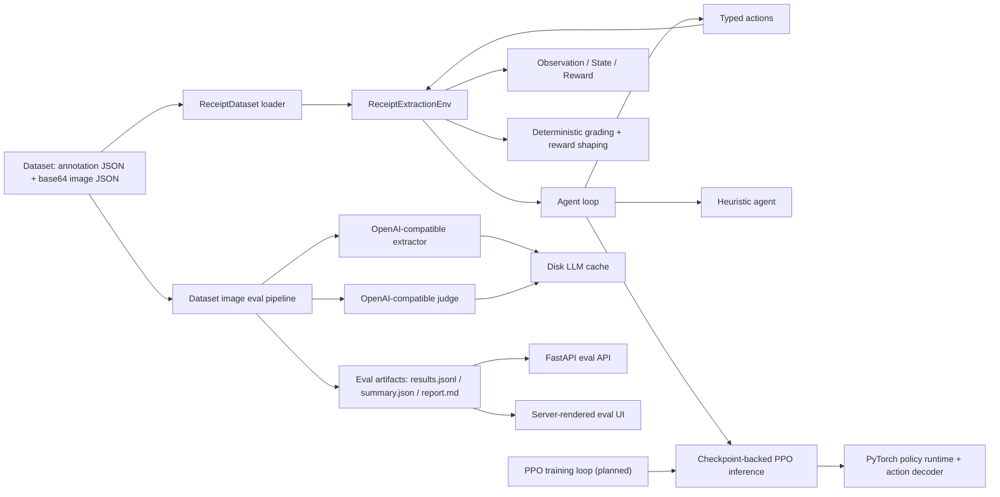

# Overall System Architecture

## Purpose

The project is a receipt-extraction environment built around the OpenEnv interaction model. The system exposes:

- a sequential receipt-extraction environment
- a deterministic heuristic baseline
- a checkpoint-backed PPO inference runtime
- a dataset-wide LLM evaluation pipeline
- a FastAPI server that serves both the OpenEnv API and a read-only evaluation UI

## High-Level View

## Main Subsystems

### 1. Dataset Layer

Primary responsibilities:

- locate the dataset root
- parse annotation JSON files
- reconstruct OCR regions from annotation boxes and transcriptions
- derive gold header and summary fields for `company`, `date`, `address`, `subtotal`, `tax`, and `total`
- derive gold line-item rows from `Item information`
- bucket samples into semantic `easy`, `medium`, and `hard` task pools

Key module:

- `env/dataset.py`

Important behavior:

- if the expected dataset directories are missing, the loader falls back to built-in mock samples
- task eligibility is now semantic:
  - `easy` requires header labels
  - `medium` requires summary labels
  - `hard` requires summary labels plus line-item labels

### 2. Environment Layer

Primary responsibilities:

- manage episode state
- expose `reset()`, `step()`, and `state()`
- reveal OCR evidence incrementally
- apply typed actions
- maintain scalar candidate lists, line-item candidates, and reconciliation feedback
- compute step and terminal rewards
- grade final drafts deterministically across headers, summaries, reconciliation, and line items

Key modules:

- `env/environment.py`
- `env/models.py`
- `env/tasks.py`
- `env/rewards.py`
- `env/graders.py`

Important design choice:

- the environment is sequential and partially observable, so the agent must gather evidence over multiple steps before submitting

### 3. Candidate And Normalization Layer

Primary responsibilities:

- generate candidate values from visible OCR regions
- generate line-item candidates for hard receipts
- normalize text, dates, addresses, and amounts
- keep grading deterministic and reproducible

Key modules:

- `env/candidate_retrieval.py`
- `env/normalizers.py`
- `env/graders.py`

This layer is intentionally rule-based so the environment stays auditable and testable.

### 4. Agent Layer

Current implementation:

- `agents/heuristic.py` provides the default rule-based baseline
- `agents/ppo.py` provides checkpoint-backed PPO inference
- `inference.py` runs the shared episode loop for both agent types

Important boundary:

- the environment provides observations, rewards, and episode boundaries
- the policy decides what to do next

### 5. Evaluation Layer

Primary responsibilities:

- walk all receipt annotation/image JSON pairs
- classify records as runnable or skipped
- run extractor and judge LLM calls for runnable records
- compute deterministic task-aware scores against gold fields and line items
- emit artifact files for later inspection

Key module:

- `env/evaluation.py`

Artifact outputs:

- `results.jsonl`
- `summary.json`
- `report.md`

### 6. LLM Integration Layer

Primary responsibilities:

- call OpenAI-compatible endpoints for extraction and judging
- use exact-match disk caching for LLM responses

Key modules:

- `env/evaluation.py`
- `env/llm_cache.py`

Important design choice:

- LLMs are used in the evaluation path, not in the environment's deterministic grading path

### 7. API And UI Layer

Primary responsibilities:

- expose OpenEnv interaction endpoints
- expose eval artifact APIs
- serve a browser UI for per-receipt inspection

Key modules:

- `env/server.py`
- `env/eval_api.py`
- `server/templates/`
- `server/static/`

Endpoints are split into two groups:

- OpenEnv endpoints: `/reset`, `/step`, `/state`
- Eval endpoints and UI: `/api/eval/*`, `/eval`

## Runtime Modes

### OpenEnv Runtime

Used when:

- running the environment directly
- calling the environment API
- running heuristic or PPO inference evaluation locally

Flow:

1. load dataset
2. reset environment into one task/sample
3. select an action
4. step environment
5. receive observation, reward, and done flag
6. repeat until submit or budget exhaustion

### Dataset Eval Runtime

Used when:

- running `scripts/evaluate_dataset_images.py`
- re-running a single receipt from the eval UI/API

Flow:

1. audit all dataset records
2. call the extraction model for runnable records
3. score predictions deterministically
4. call the judge model for explanations
5. cache LLM responses
6. write eval artifacts
7. serve artifacts through API/UI

## Deterministic vs. Model-Based Logic

Deterministic components:

- dataset parsing
- OCR-region reconstruction
- candidate retrieval heuristics
- normalization
- grading
- reward shaping
- task configuration

Model-based components:

- extraction LLM used by the dataset eval pipeline
- judge LLM used by the dataset eval pipeline
- implemented PPO inference runtime
- planned PPO training loop

This separation keeps the environment stable and reproducible even if model-backed evaluation behavior changes.

## Current Implementation Status

Implemented today:

- dataset loading
- semantic easy/medium/hard task pools
- environment loop
- deterministic heuristic baseline
- checkpoint-backed PPO inference
- FastAPI server
- dataset-wide image evaluation
- artifact-backed eval API and UI
- disk cache for LLM responses

Documented but not yet implemented:

- PPO training loop
- BC training loop
