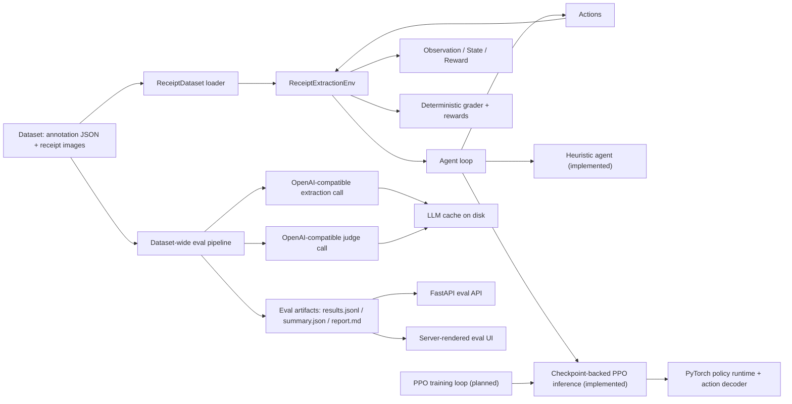

# Overall System Architecture

## Purpose

The project is a receipt-extraction environment built around the OpenEnv interaction model. The system exposes:

- a sequential environment for receipt extraction
- a deterministic heuristic baseline
- an evaluation pipeline that runs model-based extraction and judging over dataset images
- a FastAPI server that serves both the OpenEnv API and a read-only evaluation UI

## High-Level View

## Main Subsystems

### 1. Dataset Layer

Primary responsibilities:

- locate the receipt dataset root
- parse annotation JSON files
- reconstruct OCR regions from annotation boxes and transcriptions
- derive gold fields for `company`, `date`, `address`, and `total`
- bucket valid samples into easy, medium, and hard pools

Key module:

- `env/dataset.py`

Important behavior:

- if the expected dataset directories are missing, the loader falls back to small built-in mock samples
- only records with all four target fields are accepted into the environment sample pool

### 2. Environment Layer

Primary responsibilities:

- manage episode state
- expose `reset()`, `step()`, and `state()`
- reveal OCR evidence incrementally
- apply typed actions
- compute step and terminal rewards
- grade final drafts deterministically

Key modules:

- `env/environment.py`
- `env/models.py`
- `env/tasks.py`
- `env/rewards.py`
- `env/graders.py`

Important design choice:

- the environment is sequential and partially observable; the agent must gather evidence over multiple steps before submitting

### 3. Candidate And Normalization Layer

Primary responsibilities:

- generate candidate values from visible OCR regions
- normalize text, dates, addresses, and amounts
- keep field grading deterministic and reproducible

Key modules:

- `env/candidate_retrieval.py`
- `env/normalizers.py`
- `env/graders.py`

This layer is deliberately rule-based so the environment stays auditable and testable.

### 4. Agent Layer

Current implementation:

- `agents/heuristic.py` provides the rule-based baseline used by default
- `agents/ppo.py` provides a checkpoint-backed PPO inference runtime
- `inference.py` selects the requested agent and runs the shared episode loop

Important boundary:

- the agent is separate from the environment
- the environment provides observations, rewards, and episode boundaries; the policy decides what to do next

### 5. Evaluation Layer

Primary responsibilities:

- walk all receipt annotation/image pairs
- classify records as runnable or skipped
- run extraction and judge LLM calls for runnable records
- compute deterministic scores against gold fields
- emit artifact files for later inspection

Key module:

- `env/evaluation.py`

Artifact outputs:

- `results.jsonl`
- `summary.json`
- `report.md`

### 6. LLM Integration Layer

Primary responsibilities:

- call OpenAI-compatible endpoints for extraction and judging
- use exact-match disk caching for LLM responses

Key modules:

- `env/evaluation.py`
- `env/llm_cache.py`

Important design choice:

- LLMs are currently used in the evaluation path, not in the environment’s core deterministic grading path

### 7. API And UI Layer

Primary responsibilities:

- expose OpenEnv interaction endpoints
- expose eval artifact APIs
- serve a browser UI for per-receipt inspection

Key modules:

- `env/server.py`
- `env/eval_api.py`
- `server/templates/`
- `server/static/`

Endpoints are split into two groups:

- OpenEnv endpoints: `/reset`, `/step`, `/state`
- Eval endpoints and UI: `/api/eval/*`, `/eval`

## Runtime Modes

### OpenEnv Runtime

Used when:

- running the environment directly
- calling the environment API
- running heuristic baseline evaluation

Flow:

1. load dataset
2. reset environment into one task/sample
3. select an action
4. step environment
5. receive observation, reward, and done flag
6. repeat until submit or budget exhaustion

### Dataset Eval Runtime

Used when:

- running `scripts/evaluate_dataset_images.py`
- re-running a single receipt from the eval UI/API

Flow:

1. audit all dataset records
2. call the extraction model for runnable records
3. score predictions deterministically
4. call the judge model for explanations
5. cache LLM responses
6. write eval artifacts
7. serve artifacts through API/UI

## Boundaries Between Deterministic And Model-Based Logic

Deterministic components:

- dataset parsing
- OCR-region reconstruction
- candidate retrieval heuristics
- normalization
- grading
- reward shaping
- task configuration

Model-based components:

- extraction LLM used by the dataset eval pipeline
- judge LLM used by the dataset eval pipeline
- implemented PPO inference runtime
- planned PPO training loop

This separation is intentional. The environment remains stable and reproducible even if the model-backed evaluation path changes.

## Current Implementation Status

Implemented today:

- dataset loading
- environment loop
- deterministic heuristic baseline
- checkpoint-backed PPO inference path
- FastAPI server
- dataset-wide image evaluation
- artifact-backed eval API and UI
- disk cache for LLM responses

Documented but not yet implemented:

- PPO training loop
- BC training loop
